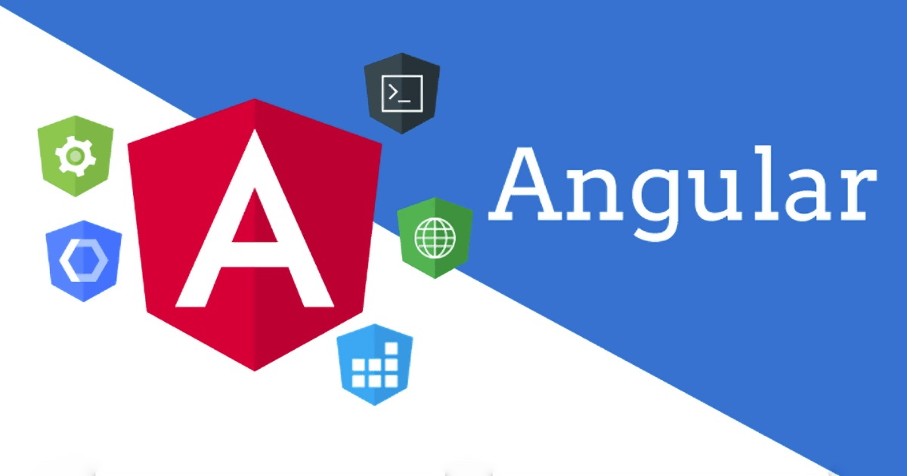
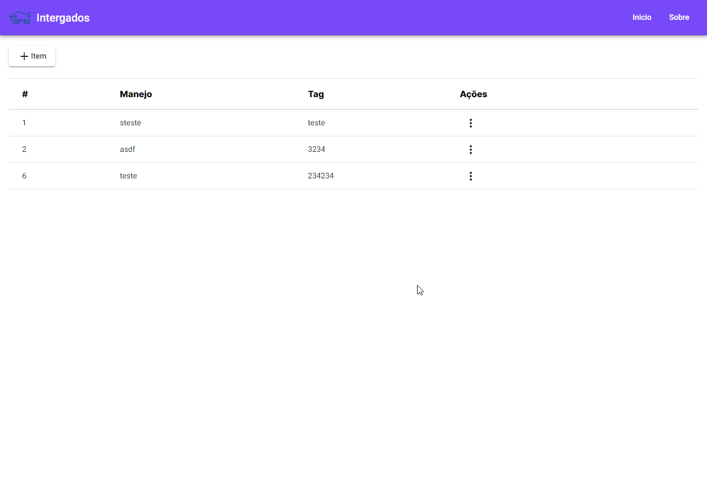
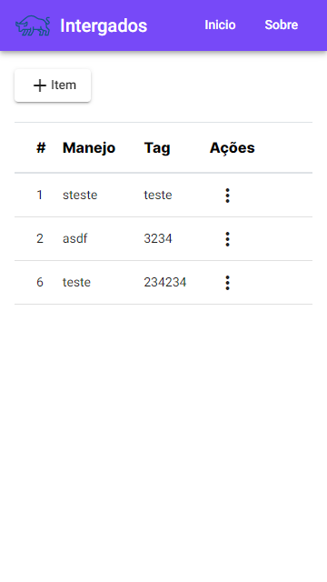

<p align="center">
  
</p>

<p align="center"> 
  
     
  <a href="https://github.com/gleisonkz">
    
  </a>  
     
     
  
</p>

<p align="center">
 <a href="#eye_speech_bubble-visualizar">Visualizar</a> •
 <a href="#information_source-sobre">Sobre</a> •
 <a href="#arrow_forward-executar">Executar</a> •
 <a href="#hammer_and_wrench-tecnologias">Tecnologias</a> • 
 <a href="#brain-conceitos-aplicados">Conceitos</a> •
 <a href="#sparkles-funcionalidades">Funcionalidades</a> •
 <a href="#boy-autor">Autor</a> •
 <a href="#balance_scale-licença">Licença</a>
</p>

---

## :eye_speech_bubble: **Visualizar**

<div align="center">

Deploy do front-end efetuado no [Netlify](https://www.netlify.com/) para visualizar: [Clique Aqui](https://intergado.netlify.app/home)

|                             :computer:Desktop                             |                             :iphone: Mobile                              |
| :-----------------------------------------------------------------------: | :----------------------------------------------------------------------: |
| <kbd></kbd> | <kbd></kbd> |

</div>
  
---

## :information_source: Sobre

<div align="center">

Crud Simples criado para consumir um back-end em Java.

---

</div>

## :arrow_forward: **Executar**

<div align="center">

Para executar esse projeto você precisa baixar este repositório, ter o Gerenciador de Pacotes do Node ([`NPM`](https://www.npmjs.com/get-npm)) ou o Gerenciador de Pacotes YARN ([`YARN`](https://yarnpkg.com/getting-started)) instalado.

🌐 FrontEnd

Abra o prompt de comando no diretório do projeto na pasta <code>intergado</code>, vá até a pasta front-end e execute os seguintes códigos:

<details>
  <summary><i>com <b>npm</b></i></summary>
  
  ```bash
  # Instalar dependências
  $ npm install ou npm i

# Iniciar o servidor de desenvolvimento

$ ng serve --open ou ng s -o

````

</details>

<details>
<summary><i>com <b>yarn</b></i></summary>

```bash
# Instalar dependências
$ yarn install

# Iniciar o servidor de desenvolvimento
$ ng serve --open ou ng s -o

````

</details>

> ⚠️ O servidor de desenvolvimento será iniciado na porta: 4200 - Acesse <http://localhost:4200>

</div>

<div align="center">

---

🖥 BackEnd (<small>jdk</small>)

Para executar é necessário ter instalado a jdk do java na versão 11 em seu computador.

Abra o prompt de comando no diretório do projeto na pasta <code>intergado</code>, vá até a pasta front-end e execute os seguintes códigos:

<details>
<summary><i>com <b>npm</b></i></summary>

```bash

# Iniciar o servidor de desenvolvimento
$ npm run server

```

</details>

<details>
<summary><i>com <b>yarn</b></i></summary>

```bash

# Iniciar o servidor de desenvolvimento
$ yarn run server

```

</details>

> ⚠️ a api será iniciada na porta: 5050 - Acesse <http://localhost:5050/api/swagger-ui.html>

</div>

---

## :hammer_and_wrench: **Tecnologias**

<div align="center">

|             :globe_with_meridians: FrontEnd             |
| :-----------------------------------------------------: |
|            [Angular 12](https://angular.io/)            |
|   [Angular Material 12](https://material.angular.io/)   |
|             [SASS](https://sass-lang.com/)              |
|    [TypeScript 4.3](https://www.typescriptlang.org/)    |
|      [Rxjs 6.6.0](https://rxjs.dev/guide/overview)      |
| [Ngneat/hot-toast](https://ngneat.github.io/hot-toast/) |

</div>

---

## :brain: **Conceitos Aplicados**

<div align="center">

|                 :page_facing_up:                 |
| :----------------------------------------------: |
| Decorators @Output, @Input, @ViewChild e @Inject |
|           Diretivas *ngFor, *ngSwitch            |
|                Template Variables                |
|            Event and Property Binding            |
|                  Reactive Forms                  |
|                     Services                     |
|                 Injection Token                  |
|               Material Components                |

</div>

---

## :sparkles: **Funcionalidades**

<div align="center">

|                :page_facing_up:                 |
| :---------------------------------------------: |
|               Listagem de Animais               |
|               Criação de Animais                |
|               Exclusão de Animais               |
| Local Storage Service para ambiente de produção |
|                Layout Responsivo                |
|   Diretiva customizada para exibição de erros   |

</div>

---

## :boy: **Autor**

<div align="center">

<a href="https://github.com/gleisonkz">
 
 <br/>
 <sub><b>Gleison de Almeida</b></sub>
</a>

Desenvolvido com ❤️ por Gleison Almeida 👋🏽 Meus Contatos!

[](https://www.linkedin.com/in/gleison-ribeiro-a65257119)
[](https://github.com/gleisonkz)
[](mailto:gleisonsubzerokz@gmail.com)

</div>

---

## :balance_scale: **Licença**

<div align="center">

Copyright © 2021 [Gleison Almeida](https://github.com/gleisonkz).<br />
This project is licensed by [MIT](./LICENSE).

</div>
